# ChatBI 关键流程时序图

## 1. 新建对话流程

### 1.1 完整流程时序图

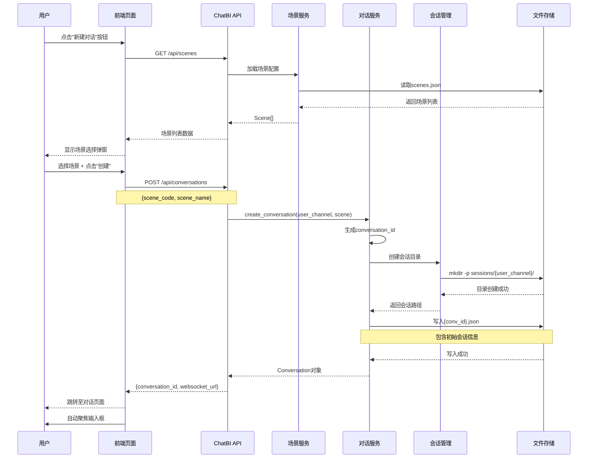
```mermaid
sequenceDiagram
    participant User as 用户
    participant Frontend as 前端页面
    participant API as ChatBI API
    participant SceneService as 场景服务
    participant ConvService as 对话服务
    participant SessionManager as 会话管理
    participant Storage as 文件存储

    User->>Frontend: 点击"新建对话"按钮
    Frontend->>API: GET /api/scenes
    API->>SceneService: 加载场景配置
    SceneService->>Storage: 读取scenes.json
    Storage-->>SceneService: 返回场景列表
    SceneService-->>API: Scene[]
    API-->>Frontend: 场景列表数据
    Frontend-->>User: 显示场景选择弹窗

    User->>Frontend: 选择场景 + 点击"创建"
    Frontend->>API: POST /api/conversations
    Note over Frontend,API: {scene_code, scene_name}

    API->>ConvService: create_conversation(user_channel, scene)
    ConvService->>ConvService: 生成conversation_id
    ConvService->>SessionManager: 创建会话目录
    SessionManager->>Storage: mkdir -p sessions/{user_channel}/
    Storage-->>SessionManager: 目录创建成功
    SessionManager-->>ConvService: 返回会话路径

    ConvService->>Storage: 写入{conv_id}.json
    Note over ConvService,Storage: 包含初始会话信息
    Storage-->>ConvService: 写入成功
    ConvService-->>API: Conversation对象
    API-->>Frontend: {conversation_id, websocket_url}
    Frontend-->>User: 跳转至对话页面
    Frontend->>User: 自动聚焦输入框
```

### 1.2 时序图说明

**关键步骤**：
1. **场景加载**：从配置文件读取可用场景
2. **会话创建**：生成唯一ID，创建会话文件
3. **目录隔离**：按user_channel创建独立目录
4. **状态初始化**：写入初始会话状态

**异常处理**：
- 场景不存在：返回400错误
- 权限不足：返回403错误
- 存储失败：返回500错误，重试机制

---

## 2. 对话交互流程

### 2.1 单轮对话（流式响应）

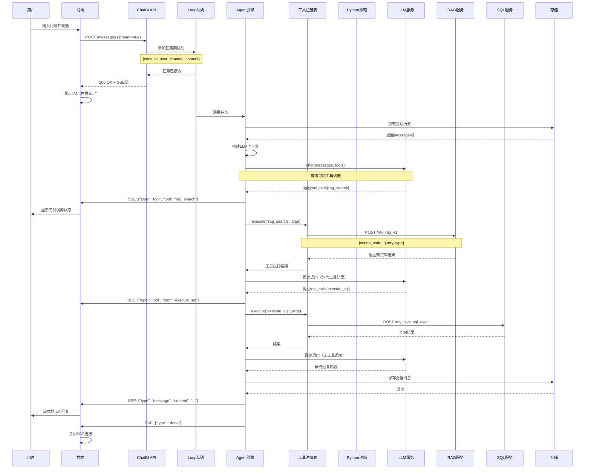
```mermaid
sequenceDiagram
    participant User as 用户
    participant Frontend as 前端
    participant API as ChatBI API
    participant Queue as Loop队列
    participant Agent as Agent引擎
    participant ToolRegistry as 工具注册表
    participant Sandbox as Python沙箱
    participant LLMProvider as LLM服务
    participant RagService as RAG服务
    participant SqlService as SQL服务
    participant Storage as 存储

    User->>Frontend: 输入问题并发送
    Frontend->>API: POST /messages (stream=true)

    API->>Queue: 添加任务到队列
    Note over API,Queue: {conv_id, user_channel, content}
    Queue-->>API: 任务已接收
    API-->>Frontend: 200 OK + SSE流

    Frontend->>Frontend: 显示"AI正在思考..."

    Queue->>Agent: 消费任务
    Agent->>Storage: 加载会话历史
    Storage-->>Agent: 返回messages[]
    Agent->>Agent: 构建LLM上下文

    Agent->>LLMProvider: chat(messages, tools)
    Note over Agent,LLMProvider: 携带可用工具列表
    LLMProvider-->>Agent: 返回tool_calls[rag_search]

    Agent->>Frontend: SSE: {"type": "tool", "tool": "rag_search"}
    Frontend->>User: 显示工具调用状态

    Agent->>ToolRegistry: execute("rag_search", args)
    ToolRegistry->>RagService: POST /my_rag_v1
    Note over ToolRegistry,RagService: {scene_code, query, type}
    RagService-->>ToolRegistry: 返回知识库结果
    ToolRegistry-->>Agent: 工具执行结果

    Agent->>LLMProvider: 再次调用（包含工具结果）
    LLMProvider-->>Agent: 返回tool_calls[execute_sql]

    Agent->>Frontend: SSE: {"type": "tool", "tool": "execute_sql"}
    Agent->>ToolRegistry: execute("execute_sql", args)
    ToolRegistry->>SqlService: POST /my_hive_sql_exec
    SqlService-->>ToolRegistry: 查询结果
    ToolRegistry-->>Agent: 结果

    Agent->>LLMProvider: 最终调用（无工具调用）
    LLMProvider-->>Agent: 最终回复内容

    Agent->>Storage: 保存会话消息
    Storage-->>Agent: 成功

    Agent->>Frontend: SSE: {"type": "message", "content": "..."}
    Frontend->>User: 流式显示AI回复

    Agent->>Frontend: SSE: {"type": "done"}
    Frontend->>Frontend: 关闭SSE连接
```

### 2.2 时序图说明

**关键流程**：
1. **异步处理**：API层将任务放入队列，立即返回SSE流
2. **流式响应**：通过Server-Sent Events实时推送进度
3. **工具链调用**：多个工具按LLM决策顺序执行
4. **状态反馈**：每个工具调用状态实时推送到前端
5. **持久化**：对话完成后保存到存储

**并发控制**：
- 单个用户单会话：顺序执行
- 单个用户多会话：可并行
- 多用户：完全并行

---

## 3. Python代码执行流程

### 3.1 代码生成与执行

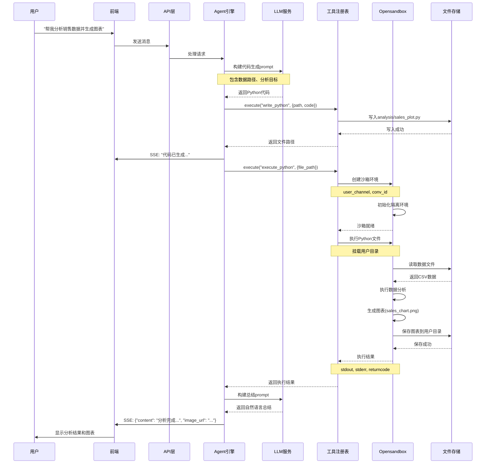
```mermaid
sequenceDiagram
    participant User as 用户
    participant Frontend as 前端
    participant API as API层
    participant Agent as Agent引擎
    participant LLM as LLM服务
    participant ToolRegistry as 工具注册表
    participant Sandbox as Opensandbox
    participant Storage as 文件存储

    User->>Frontend: "帮我分析销售数据并生成图表"
    Frontend->>API: 发送消息
    API->>Agent: 处理请求

    Agent->>LLM: 构建代码生成prompt
    Note over Agent,LLM: 包含数据路径、分析目标
    LLM-->>Agent: 返回Python代码

    Agent->>ToolRegistry: execute("write_python", {path, code})
    ToolRegistry->>Storage: 写入analysis/sales_plot.py
    Storage-->>ToolRegistry: 写入成功
    ToolRegistry-->>Agent: 返回文件路径

    Agent->>Frontend: SSE: "代码已生成..."
    Agent->>ToolRegistry: execute("execute_python", {file_path})

    ToolRegistry->>Sandbox: 创建沙箱环境
    Note over ToolRegistry,Sandbox: user_channel, conv_id
    Sandbox->>Sandbox: 初始化隔离环境
    Sandbox-->>ToolRegistry: 沙箱就绪

    ToolRegistry->>Sandbox: 执行Python文件
    Note over ToolRegistry,Sandbox: 挂载用户目录
    Sandbox->>Storage: 读取数据文件
    Storage-->>Sandbox: 返回CSV数据
    Sandbox->>Sandbox: 执行数据分析
    Sandbox->>Sandbox: 生成图表(sales_chart.png)
    Sandbox->>Storage: 保存图表到用户目录
    Storage-->>Sandbox: 保存成功
    Sandbox-->>ToolRegistry: 执行结果
    Note over Sandbox,ToolRegistry: stdout, stderr, returncode

    ToolRegistry-->>Agent: 返回执行结果
    Agent->>LLM: 构建总结prompt
    LLM-->>Agent: 返回自然语言总结

    Agent->>Frontend: SSE: {"content": "分析完成...", "image_url": "..."}
    Frontend->>User: 显示分析结果和图表
```

### 3.2 时序图说明

**安全机制**：
1. **沙箱隔离**：每个请求独立沙箱
2. **资源限制**：CPU、内存、磁盘、网络
3. **文件访问**：只能访问用户目录下的文件
4. **超时控制**：自动终止超时任务

**错误处理**：
- 代码语法错误：捕获异常，返回错误信息
- 运行时错误：返回stderr，LLM分析原因
- 资源超限：强制终止，返回错误码

---

## 4. SQL查询流程

### 4.1 SQL生成与执行

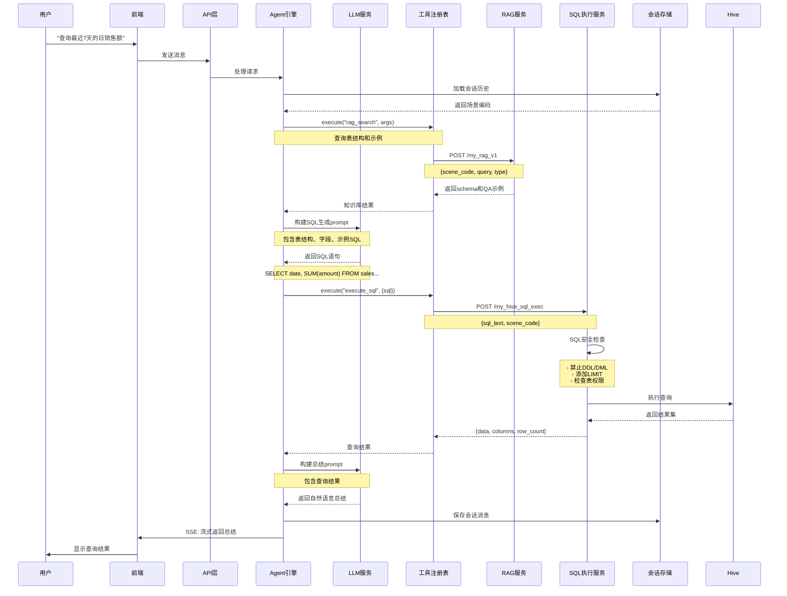
```mermaid
sequenceDiagram
    participant User as 用户
    participant Frontend as 前端
    participant API as API层
    participant Agent as Agent引擎
    participant LLM as LLM服务
    participant ToolRegistry as 工具注册表
    participant RagService as RAG服务
    participant SqlService as SQL执行服务
    participant Storage as 会话存储

    User->>Frontend: "查询最近7天的日销售额"
    Frontend->>API: 发送消息
    API->>Agent: 处理请求

    Agent->>Storage: 加载会话历史
    Storage-->>Agent: 返回场景编码

    Agent->>ToolRegistry: execute("rag_search", args)
    Note over Agent,ToolRegistry: 查询表结构和示例
    ToolRegistry->>RagService: POST /my_rag_v1
    Note over ToolRegistry,RagService: {scene_code, query, type}
    RagService-->>ToolRegistry: 返回schema和QA示例
    ToolRegistry-->>Agent: 知识库结果

    Agent->>LLM: 构建SQL生成prompt
    Note over Agent,LLM: 包含表结构、字段、示例SQL
    LLM-->>Agent: 返回SQL语句
    Note over Agent,LLM: SELECT date, SUM(amount) FROM sales...

    Agent->>ToolRegistry: execute("execute_sql", {sql})
    ToolRegistry->>SqlService: POST /my_hive_sql_exec
    Note over ToolRegistry,SqlService: {sql_text, scene_code}

    SqlService->>SqlService: SQL安全检查
    Note over SqlService: - 禁止DDL/DML<br/>- 添加LIMIT<br/>- 检查表权限
    SqlService->>Hive: 执行查询
    Hive-->>SqlService: 返回结果集
    SqlService-->>ToolRegistry: {data, columns, row_count}

    ToolRegistry-->>Agent: 查询结果
    Agent->>LLM: 构建总结prompt
    Note over Agent,LLM: 包含查询结果
    LLM-->>Agent: 返回自然语言总结

    Agent->>Storage: 保存会话消息
    Agent->>Frontend: SSE: 流式返回总结
    Frontend->>User: 显示查询结果
```

### 4.2 SQL安全检查

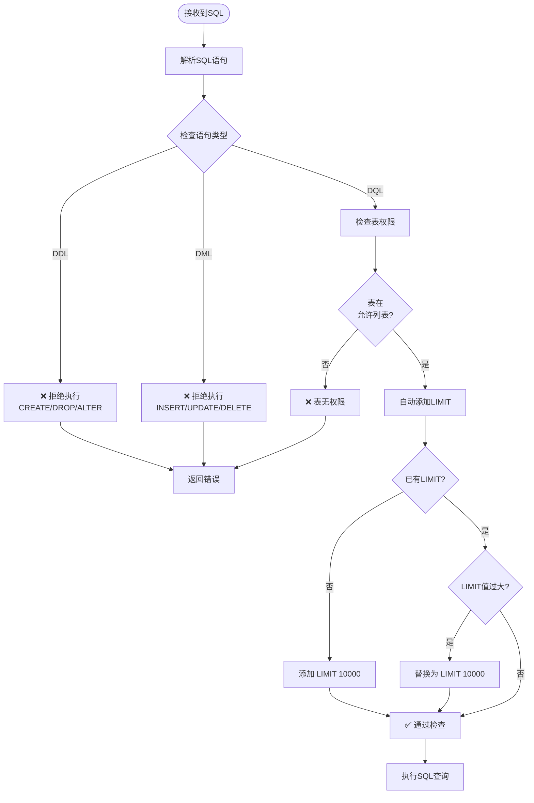
```mermaid
flowchart TD
    Start([接收到SQL]) --> Parse[解析SQL语句]
    Parse --> CheckType{检查语句类型}
    
    CheckType -->|DDL| Reject[❌ 拒绝执行<br/>CREATE/DROP/ALTER]
    CheckType -->|DML| Reject2[❌ 拒绝执行<br/>INSERT/UPDATE/DELETE]
    CheckType -->|DQL| CheckTable[检查表权限]
    
    CheckTable --> Allowed{表在<br/>允许列表?}
    Allowed -->|否| Reject3[❌ 表无权限]
    Allowed -->|是| AddLimit[自动添加LIMIT]
    
    AddLimit --> CheckLimit{已有LIMIT?}
    CheckLimit -->|否| Add[添加 LIMIT 10000]
    CheckLimit -->|是| CheckSize{LIMIT值过大?}
    
    CheckSize -->|是| Replace[替换为 LIMIT 10000]
    CheckSize -->|否| Pass[✅ 通过检查]
    Add --> Pass
    Replace --> Pass
    
    Pass --> Execute[执行SQL查询]
    Reject --> Error[返回错误]
    Reject2 --> Error
    Reject3 --> Error
```

---

## 5. 多Channel消息处理流程

### 5.1 统一消息处理

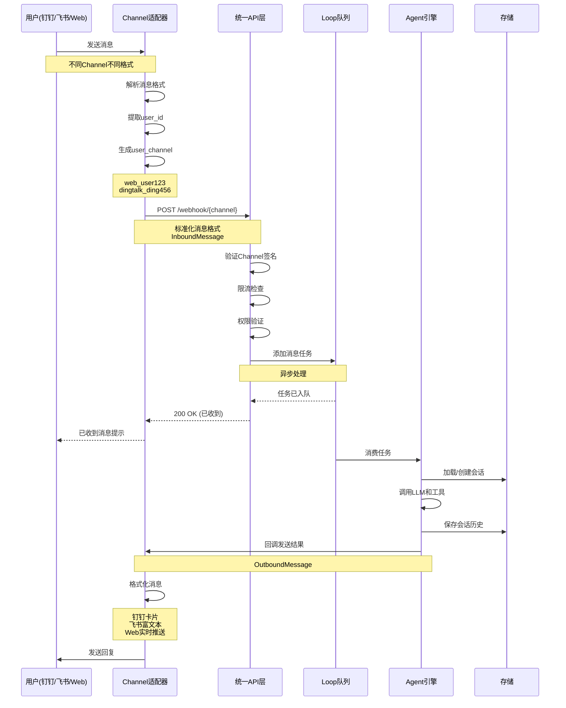
```mermaid
sequenceDiagram
    participant User as 用户(钉钉/飞书/Web)
    participant Channel as Channel适配器
    participant API as 统一API层
    participant Queue as Loop队列
    participant Agent as Agent引擎
    participant Storage as 存储

    User->>Channel: 发送消息
    Note over User,Channel: 不同Channel不同格式

    Channel->>Channel: 解析消息格式
    Channel->>Channel: 提取user_id
    Channel->>Channel: 生成user_channel
    Note over Channel: web_user123<br/>dingtalk_ding456

    Channel->>API: POST /webhook/{channel}
    Note over Channel,API: 标准化消息格式<br/>InboundMessage

    API->>API: 验证Channel签名
    API->>API: 限流检查
    API->>API: 权限验证

    API->>Queue: 添加消息任务
    Note over API,Queue: 异步处理
    Queue-->>API: 任务已入队
    API-->>Channel: 200 OK (已收到)
    Channel-->>User: 已收到消息提示

    Queue->>Agent: 消费任务
    Agent->>Storage: 加载/创建会话
    Agent->>Agent: 调用LLM和工具
    Agent->>Storage: 保存会话历史

    Agent->>Channel: 回调发送结果
    Note over Agent,Channel: OutboundMessage
    Channel->>Channel: 格式化消息
    Note over Channel: 钉钉卡片<br/>飞书富文本<br/>Web实时推送
    Channel->>User: 发送回复
```

### 5.2 Channel差异处理

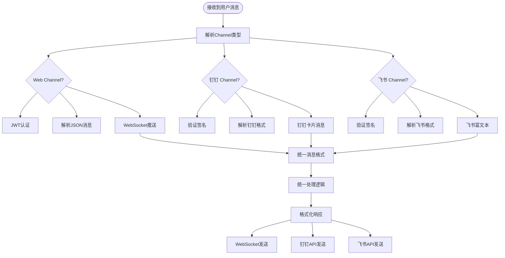
```mermaid
graph TD
    Start([接收到用户消息]) --> Parse[解析Channel类型]
    
    Parse --> Web{Web Channel?}
    Parse --> DingTalk{钉钉 Channel?}
    Parse --> Feishu{飞书 Channel?}
    
    Web --> WebAuth[JWT认证]
    Web --> WebMsg[解析JSON消息]
    Web --> WebFormat[WebSocket推送]
    
    DingTalk --> DingAuth[验证签名]
    DingTalk --> DingMsg[解析钉钉格式]
    DingTalk --> DingFormat[钉钉卡片消息]
    
    Feishu --> FeishuAuth[验证签名]
    Feishu --> FeishuMsg[解析飞书格式]
    Feishu --> FeishuFormat[飞书富文本]
    
    WebFormat --> Unified[统一消息格式]
    DingFormat --> Unified
    FeishuFormat --> Unified
    
    Unified --> Process[统一处理逻辑]
    Process --> WebResp[格式化响应]
    
    WebResp --> WebSend[WebSocket发送]
    WebResp --> DingSend[钉钉API发送]
    WebResp --> FeishuSend[飞书API发送]
```

---

## 6. 错误处理和恢复流程

### 6.1 LLM调用失败重试

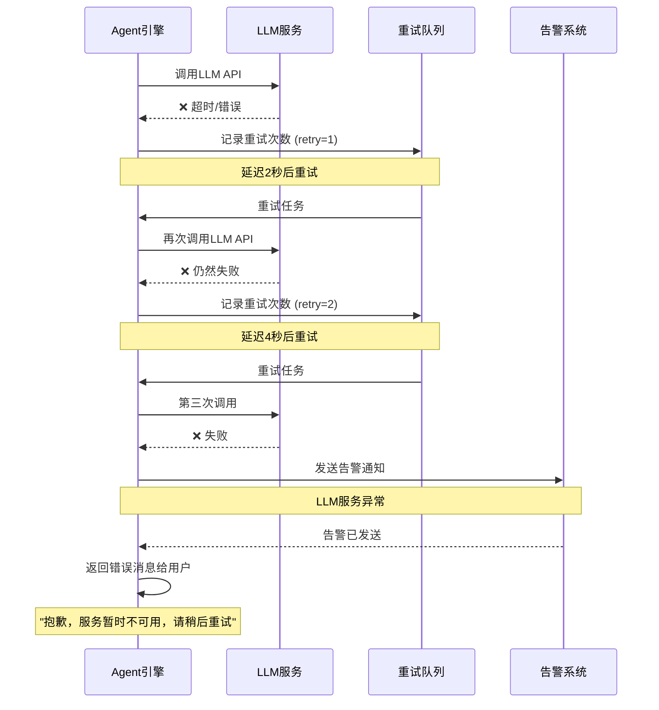
```mermaid
sequenceDiagram
    participant Agent as Agent引擎
    participant LLM as LLM服务
    participant Queue as 重试队列
    participant Alert as 告警系统

    Agent->>LLM: 调用LLM API
    LLM-->>Agent: ❌ 超时/错误
    
    Agent->>Queue: 记录重试次数 (retry=1)
    Note over Agent,Queue: 延迟2秒后重试
    
    Queue->>Agent: 重试任务
    Agent->>LLM: 再次调用LLM API
    LLM-->>Agent: ❌ 仍然失败
    
    Agent->>Queue: 记录重试次数 (retry=2)
    Note over Agent,Queue: 延迟4秒后重试
    
    Queue->>Agent: 重试任务
    Agent->>LLM: 第三次调用
    LLM-->>Agent: ❌ 失败
    
    Agent->>Alert: 发送告警通知
    Note over Agent,Alert: LLM服务异常
    Alert-->>Agent: 告警已发送
    
    Agent->>Agent: 返回错误消息给用户
    Note over Agent: "抱歉，服务暂时不可用，请稍后重试"
```

### 6.2 沙箱执行失败处理

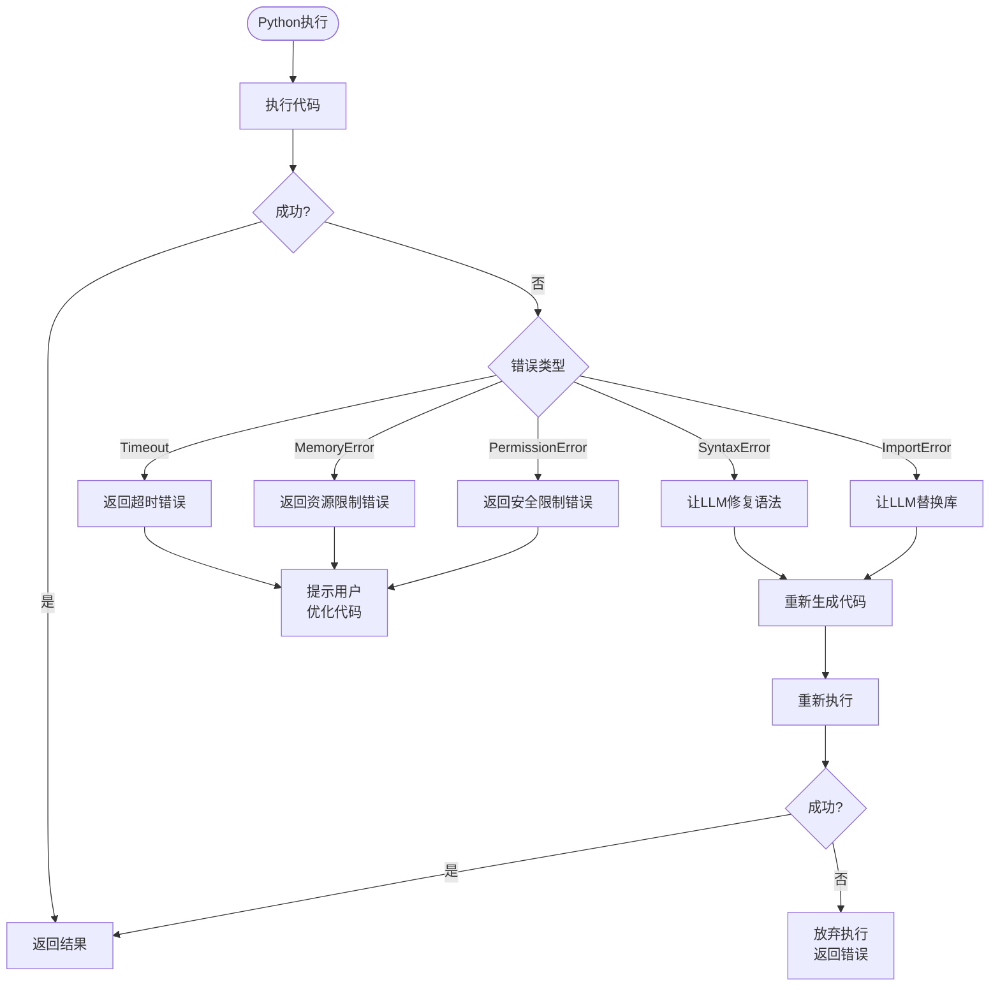
```mermaid
flowchart TD
    Start([Python执行]) --> Execute[执行代码]
    Execute --> Success{成功?}
    
    Success -->|是| Return[返回结果]
    Success -->|否| ErrorType{错误类型}
    
    ErrorType -->|SyntaxError| LLMFix[让LLM修复语法]
    ErrorType -->|ImportError| LLMFix2[让LLM替换库]
    ErrorType -->|Timeout| Timeout[返回超时错误]
    ErrorType -->|MemoryError| Resource[返回资源限制错误]
    ErrorType -->|PermissionError| Security[返回安全限制错误]
    
    LLMFix --> Regenerate[重新生成代码]
    LLMFix2 --> Regenerate
    
    Regenerate --> ReExecute[重新执行]
    ReExecute --> Success2{成功?}
    
    Success2 -->|是| Return
    Success2 -->|否| GiveUp[放弃执行<br/>返回错误]
    
    Timeout --> User[提示用户<br/>优化代码]
    Resource --> User
    Security --> User
```

---

## 7. 用户隔离和资源管理

### 7.1 用户目录隔离

```mermaid
graph TD
    Root[/workspace/] --> Sessions[sessions/]
    Root --> Files[files/]
    Root --> Sandbox[sandbox/]
    Root --> Shared[shared/]
    
    Sessions --> User1[web_user123/]
    Sessions --> User2[dingtalk_ding456/]
    Sessions --> User3[feishu_fei789/]
    
    User1 --> Conv1[conv_001.json]
    User1 --> Conv2[conv_002.json]
    User2 --> Conv3[conv_003.json]
    
    Files --> User1Files[web_user123/]
    Files --> User2Files[dingtalk_ding456/]
    
    User1Files --> Data1[data/]
    User1Files --> Analysis1[analysis/]
    Data1 --> CSV1[sales.csv]
    Analysis1 --> Chart1[sales_plot.png]
    
    Sandbox --> User1Sandbox[web_user123/]
    Sandbox --> User2Sandbox[dingtalk_ding456/]
    
    User1Sandbox --> Conv1Sandbox[conv_001/]
    User1Sandbox --> Conv2Sandbox[conv_002/]
    
    Conv1Sandbox --> WorkDir[工作目录]
    Conv1Sandbox --> TmpDir[/tmp]
    
    Shared --> Scenes[scenes.json]
    Shared --> Logs[audit.log]
```

### 7.2 沙箱资源限制

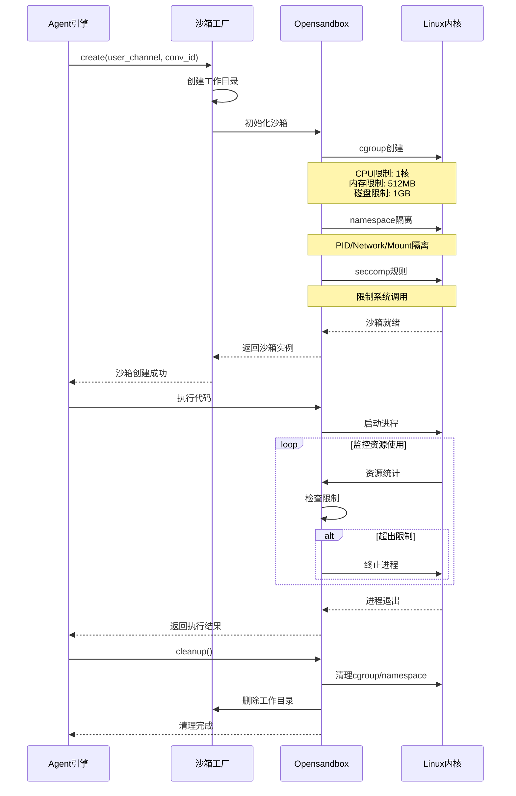
```mermaid
sequenceDiagram
    participant Agent as Agent引擎
    participant Sandbox as 沙箱工厂
    participant Opensandbox as Opensandbox
    participant Kernel as Linux内核

    Agent->>Sandbox: create(user_channel, conv_id)
    Sandbox->>Sandbox: 创建工作目录
    
    Sandbox->>Opensandbox: 初始化沙箱
    Opensandbox->>Kernel: cgroup创建
    Note over Opensandbox,Kernel: CPU限制: 1核<br/>内存限制: 512MB<br/>磁盘限制: 1GB
    
    Opensandbox->>Kernel: namespace隔离
    Note over Opensandbox,Kernel: PID/Network/Mount隔离
    
    Opensandbox->>Kernel: seccomp规则
    Note over Opensandbox,Kernel: 限制系统调用
    
    Kernel-->>Opensandbox: 沙箱就绪
    Opensandbox-->>Sandbox: 返回沙箱实例
    Sandbox-->>Agent: 沙箱创建成功
    
    Agent->>Opensandbox: 执行代码
    Opensandbox->>Kernel: 启动进程
    
    loop 监控资源使用
        Kernel->>Opensandbox: 资源统计
        Opensandbox->>Opensandbox: 检查限制
        alt 超出限制
            Opensandbox->>Kernel: 终止进程
        end
    end
    
    Kernel-->>Opensandbox: 进程退出
    Opensandbox-->>Agent: 返回执行结果
    
    Agent->>Opensandbox: cleanup()
    Opensandbox->>Kernel: 清理cgroup/namespace
    Opensandbox->>Sandbox: 删除工作目录
    Opensandbox-->>Agent: 清理完成
```

---

## 8. 会话持久化和恢复

### 8.1 会话保存流程

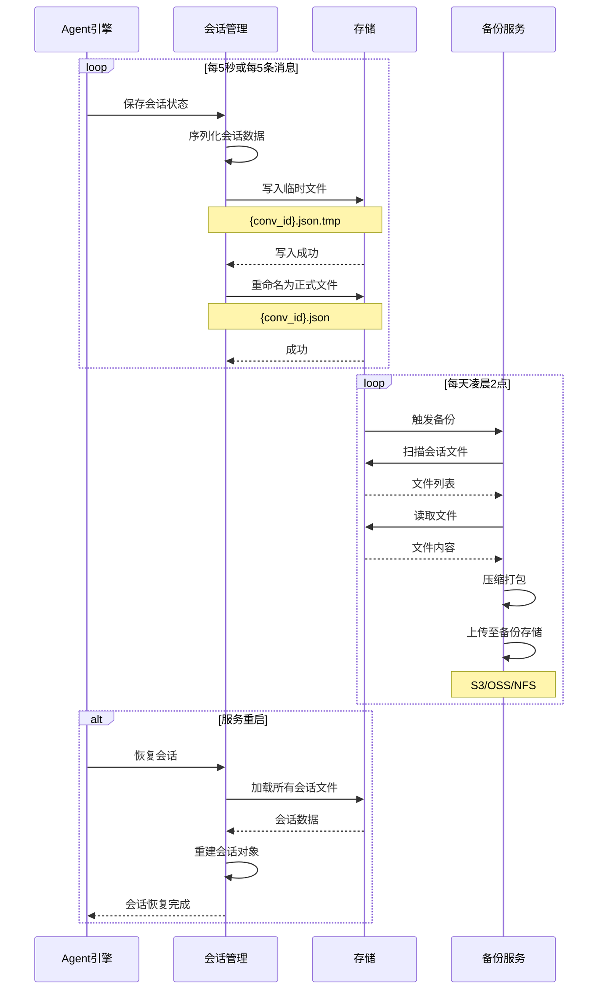
```mermaid
sequenceDiagram
    participant Agent as Agent引擎
    participant Session as 会话管理
    participant Storage as 存储
    participant Backup as 备份服务

    loop 每5秒或每5条消息
        Agent->>Session: 保存会话状态
        Session->>Session: 序列化会话数据
        Session->>Storage: 写入临时文件
        Note over Session,Storage: {conv_id}.json.tmp
        Storage-->>Session: 写入成功
        
        Session->>Storage: 重命名为正式文件
        Note over Session,Storage: {conv_id}.json
        Storage-->>Session: 成功
    end
    
    loop 每天凌晨2点
        Storage->>Backup: 触发备份
        Backup->>Storage: 扫描会话文件
        Storage-->>Backup: 文件列表
        
        Backup->>Storage: 读取文件
        Storage-->>Backup: 文件内容
        Backup->>Backup: 压缩打包
        Backup->>Backup: 上传至备份存储
        Note over Backup: S3/OSS/NFS
    end
    
    alt 服务重启
        Agent->>Session: 恢复会话
        Session->>Storage: 加载所有会话文件
        Storage-->>Session: 会话数据
        Session->>Session: 重建会话对象
        Session-->>Agent: 会话恢复完成
    end
```

### 8.2 会话恢复

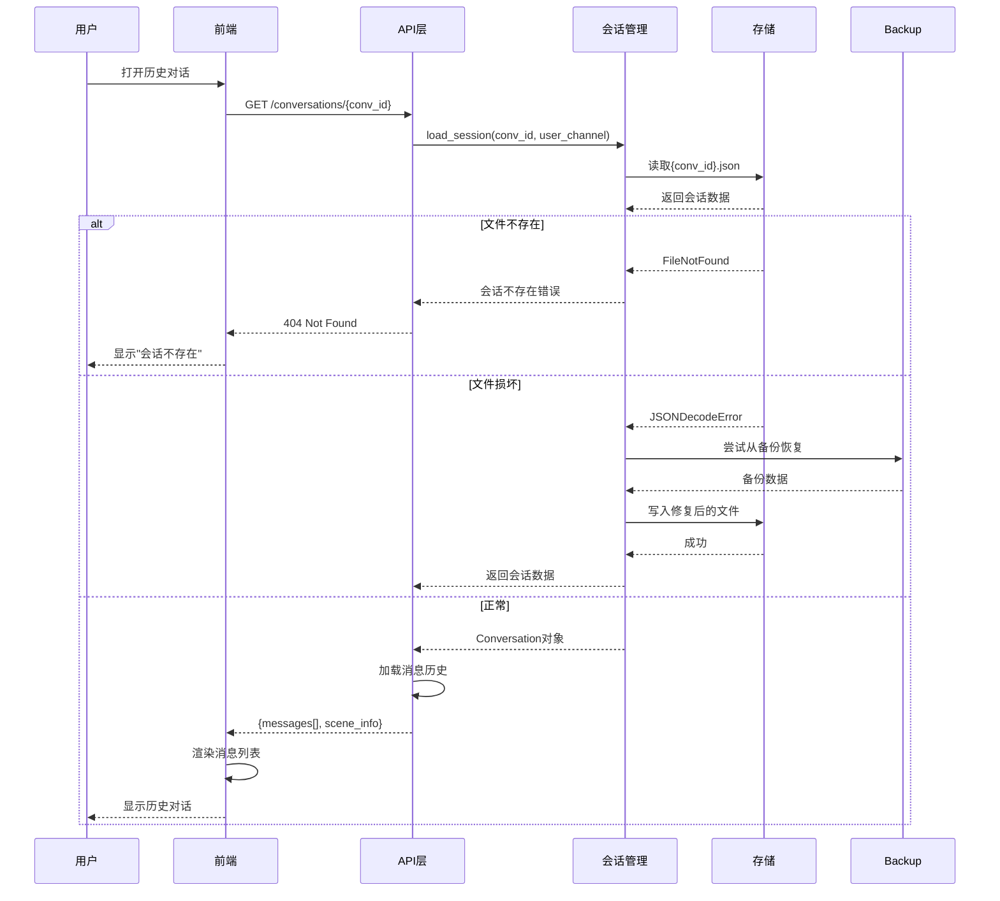
```mermaid
sequenceDiagram
    participant User as 用户
    participant Frontend as 前端
    participant API as API层
    participant Session as 会话管理
    participant Storage as 存储

    User->>Frontend: 打开历史对话
    Frontend->>API: GET /conversations/{conv_id}
    
    API->>Session: load_session(conv_id, user_channel)
    Session->>Storage: 读取{conv_id}.json
    Storage-->>Session: 返回会话数据
    
    alt 文件不存在
        Storage-->>Session: FileNotFound
        Session-->>API: 会话不存在错误
        API-->>Frontend: 404 Not Found
        Frontend-->>User: 显示"会话不存在"
    else 文件损坏
        Storage-->>Session: JSONDecodeError
        Session->>Backup: 尝试从备份恢复
        Backup-->>Session: 备份数据
        Session->>Storage: 写入修复后的文件
        Storage-->>Session: 成功
        Session-->>API: 返回会话数据
    else 正常
        Session-->>API: Conversation对象
        API->>API: 加载消息历史
        API-->>Frontend: {messages[], scene_info}
        Frontend->>Frontend: 渲染消息列表
        Frontend-->>User: 显示历史对话
    end
```

---

## 9. 系统启动和初始化

### 9.1 服务启动流程

```mermaid
sequenceDiagram
    participant Main as 主进程
    participant Config as 配置加载
    participant Storage as 存储初始化
    participant Queue as 队列初始化
    participant Registry as 工具注册
    participant Agent as Agent引擎
    participant API as API服务

    Main->>Config: 加载配置文件
    Config->>Config: 读取config/*.yaml
    Config->>Config: 验证配置格式
    Config->>Config: 环境变量替换
    Config-->>Main: 配置对象
    
    Main->>Storage: 初始化存储
    Storage->>Storage: 创建工作目录
    Note over Storage: /workspace/{sessions,files,sandbox}
    Storage-->>Main: 存储就绪
    
    Main->>Queue: 初始化消息队列
    alt Redis模式
        Queue->>Queue: 连接Redis
        Queue-->>Main: Redis队列就绪
    else 内存模式
        Queue->>Queue: 创建内存队列
        Queue-->>Main: 内存队列就绪
    end
    
    Main->>Registry: 注册工具
    Registry->>Registry: 注册read_file
    Registry->>Registry: 注册write_python
    Registry->>Registry: 注册execute_python
    Registry->>Registry: 注册rag_search
    Registry->>Registry: 注册execute_sql
    Registry-->>Main: 工具注册完成
    
    Main->>Agent: 初始化Agent引擎
    Agent->>Agent: 创建Agent Loop
    Agent->>Agent: 加载工具注册表
    Agent->>Agent: 连接LLM服务
    Agent-->>Main: Agent引擎就绪
    
    Main->>API: 启动API服务
    API->>API: 注册路由
    API->>API: 加载中间件
    API->>API: 启动HTTP服务器
    API-->>Main: API服务就绪
    
    Main->>Main: 启动Agent Loop线程
    Note over Main: 开始消费消息队列
    
    Main->>Main: 输出启动日志
    Note over Main: "ChatBI服务启动成功
    端口: 8000
    工作目录: /workspace"
```

---

## 10. 关键性能路径

### 10.1 LLM调用性能优化

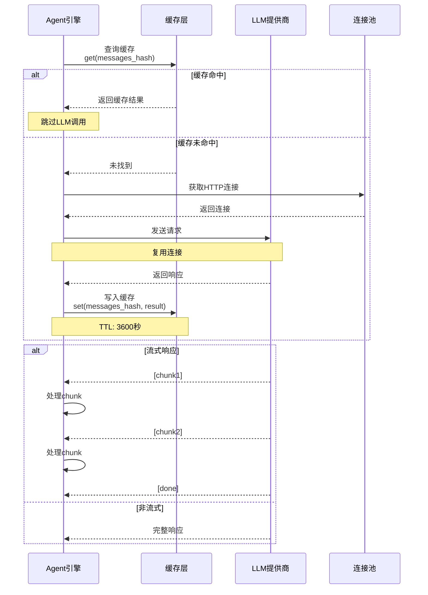
```mermaid
sequenceDiagram
    participant Agent as Agent引擎
    participant Cache as 缓存层
    participant LLMProvider as LLM提供商
    participant Pool as 连接池

    Agent->>Cache: 查询缓存<br/>get(messages_hash)
    
    alt 缓存命中
        Cache-->>Agent: 返回缓存结果
        Note over Agent: 跳过LLM调用
    else 缓存未命中
        Cache-->>Agent: 未找到
        
        Agent->>Pool: 获取HTTP连接
        Pool-->>Agent: 返回连接
        
        Agent->>LLMProvider: 发送请求
        Note over Agent,LLMProvider: 复用连接
        
        LLMProvider-->>Agent: 返回响应
        
        Agent->>Cache: 写入缓存<br/>set(messages_hash, result)
        Note over Agent,Cache: TTL: 3600秒
    end
    
    alt 流式响应
        LLMProvider-->>Agent: [chunk1]
        Agent->>Agent: 处理chunk
        LLMProvider-->>Agent: [chunk2]
        Agent->>Agent: 处理chunk
        LLMProvider-->>Agent: [done]
    else 非流式
        LLMProvider-->>Agent: 完整响应
    end
```

### 10.2 并行工具调用

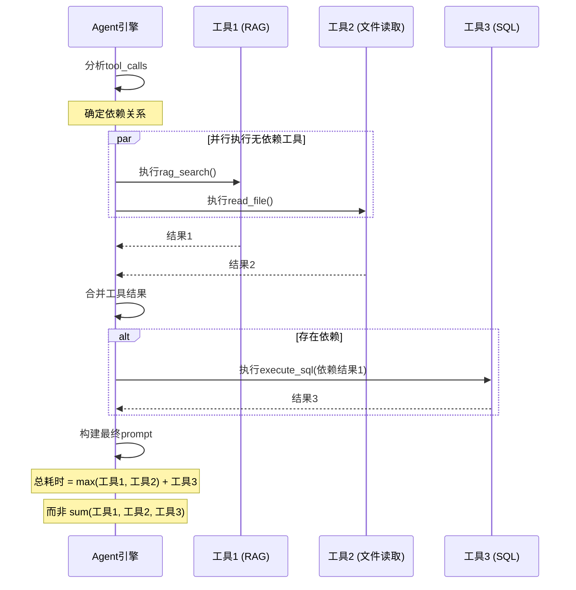
```mermaid
sequenceDiagram
    participant Agent as Agent引擎
    participant Tool1 as 工具1 (RAG)
    participant Tool2 as 工具2 (文件读取)
    participant Tool3 as 工具3 (SQL)

    Agent->>Agent: 分析tool_calls
    Note over Agent: 确定依赖关系
    
    par 并行执行无依赖工具
        Agent->>Tool1: 执行rag_search()
        Agent->>Tool2: 执行read_file()
    end
    
    Tool1-->>Agent: 结果1
    Tool2-->>Agent: 结果2
    
    Agent->>Agent: 合并工具结果
    
    alt 存在依赖
        Agent->>Tool3: 执行execute_sql(依赖结果1)
        Tool3-->>Agent: 结果3
    end
    
    Agent->>Agent: 构建最终prompt
    
    Note over Agent: 总耗时 = max(工具1, 工具2) + 工具3
    Note over Agent: 而非 sum(工具1, 工具2, 工具3)
```

---

## 时序图使用说明

### 如何阅读时序图

1. **时间顺序**：从上到下，表示时间流逝
2. **参与者**：左侧是系统组件，右侧是用户或外部服务
3. **消息箭头**：
   - 实线箭头：同步调用，等待响应
   - 虚线箭头：异步调用或返回
   - 平行线：并行执行
4. **Note**：注释框用于说明关键逻辑或条件判断

### 关键路径标识

- **红色路径**：错误处理路径
- **绿色路径**：主流程成功路径
- **蓝色路径**：优化或缓存路径
- **黄色区域**：并行执行区域

### 性能关键点

- **⭐**：性能优化点
- **⚠️**：潜在风险点
- **🔒**：安全控制点
- **💾**：持久化点

这些时序图完整覆盖了ChatBI平台的核心流程，包括对话创建、消息处理、代码执行、SQL查询、多Channel适配、错误处理、用户隔离等关键场景。